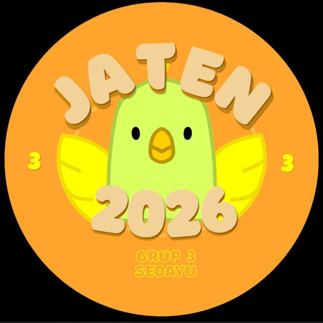

<div align="center">



# 🏠 Peta Digital Rumah Warga Jaten
### *Web-based Geographic Information System (Web-GIS)*

[](https://ukdw.ac.id)
[](https://leafletjs.com/)
[](#)

---

Aplikasi pemetaan digital berbasis web yang dikembangkan khusus untuk memetakan sebaran lokasi tempat tinggal warga serta identifikasi mata pencaharian di **Dusun Jaten**. 

Diinisiasi sebagai program kerja **KKN ISL UKDW 2026 | Kelompok Jaten**.

</div>

<br>

> **Fitur Unggulan** : Mengintegrasikan **Google Sheets API** (publikasi CSV) sebagai *database real-time*. Memungkinkan pengurus dusun atau tim KKN memperbarui data warga secara langsung melalui spreadsheet tanpa perlu mengubah kode program.

---

## 💡 Fitur Utama

| Fitur | Deskripsi |
| :--- | :--- |
| **Peta Interaktif** | Navigasi responsif berbasis **Leaflet.js** dengan *zoom control* dan tata letak dinamis. |
| **Layer Toggle** | Perpindahan mode tampilan peta secara fleksibel: **Peta Jalan (OSM)**, **Satelit Google**, dan **Hybrid**. |
| **Live Search & Sidebar** | Pencarian instan berdasarkan nama warga atau alamat dengan interaksi kartu daftar warga. |
| **Smart Markers** | Marker peta dinamis. Menggunakan ikon khusus `🐦` secara otomatis untuk warga pengrajin sangkar burung. |
| **Google Maps Integration** | Pop-up detail warga dilengkapi tombol pintasan rute langsung menuju aplikasi Google Maps. |
| **Fully Responsive UI** | Desain *mobile-first* yang nyaman diakses melalui smartphone, tablet, maupun komputer desktop. |

---

## 📁 Struktur Folder

Pemisahan kode dibuat modular dan bersih (*clean code*) untuk kemudahan pengembangan jangka panjang:

```text
📦 peta-warga-jaten
 ┣ 📜 index.html        # Struktur DOM, logika antarmuka, & penanganan data JavaScript
 ┣ 🎨 style.css         # Styling, variabel warna, animasi, & breakpoint responsif
 ┣ 🖼️ Logo_ISL.png      # Logo identitas kegiatan KKN ISL UKDW
 ┗ 🖼️ peta.jpg          # Aset visual penunjuk arah mata angin (kompas)